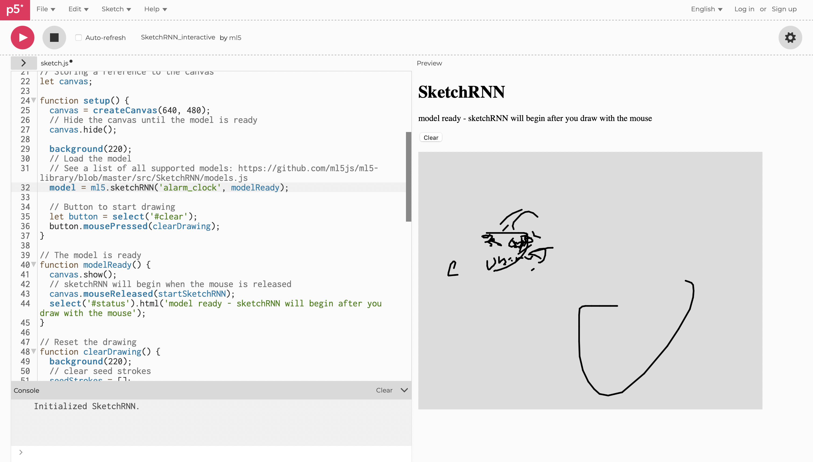
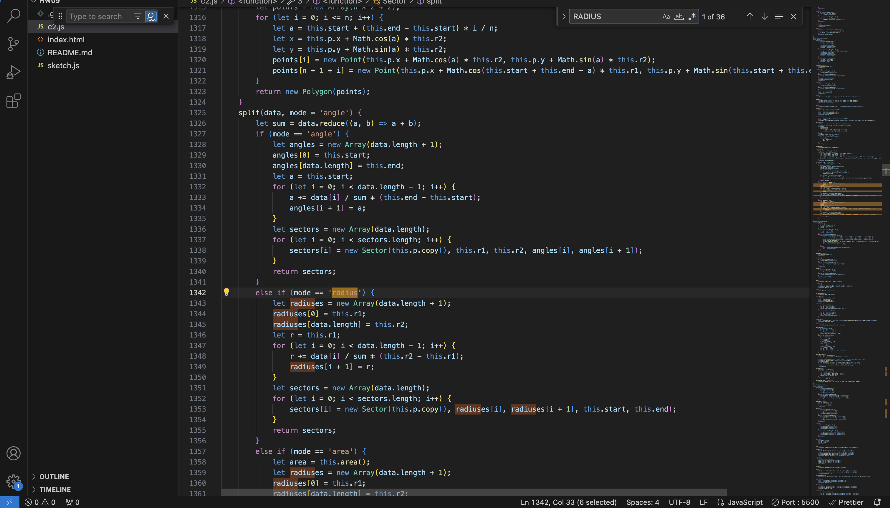
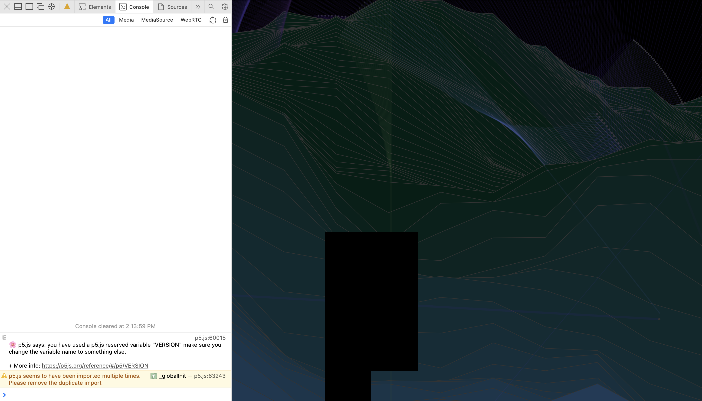

# Experimenting with dif libraries
To start this week's process, I began by reading the websites of different libraries. I went thourhg ml5js, but wasn't sure what I want to do with the camera features. I tried this SketchRnn (https://learn.ml5js.org/#/reference/sketchrnn) where it claimed to draw doodles of various things like cats and alarm clocks, but I tried the p5js editor and the model didn't work well:  


Then, I looked into the C2 web (https://renyuan.io/c2.js/) and some examples. Shape generations and collisions are fun to see, so I began exploring how use them. I asked you how to figure out the initial setting. I read the c2 js to understand some settings:



# Imagine what I want to do
I'm preparing a video scene for another class' project. We want to implement a Cyberpunk shot. Viewing the examples of C2 give me an inspiration of creating the similar vibe. 

To start, I changed the rotation direction and movement of the line arrays to experiment. 


To recreate a cyberpunk vibe like this:


I began by changing the color mode to RGB. Then, I imported another example using c2 tool Perlin to create the mountain-like shapes (https://renyuan.io/c2.js/examples.html?name=Perlin). I began by adjusting the y position of the movement range and movement speed & opacity to create the vibe. I created two rectangle-shape buildings to create the city. 




# Moving the building
I began moving the building by adding the x. I got some interesting visual effects. I adjusted the building sizes and did some framecount animations. 


# p5.js Template

This is a README file that can be used to describe and document your assignment.

Markdown Cheatsheet (from [https://www.markdownguide.org/cheat-sheet/](https://www.markdownguide.org/cheat-sheet/)):

---
---

# Heading1
## Heading2
### Heading3
#### Heading4
##### Heading5
###### Heading6

**bold text**

*italicized text*

~~strikethrough text~~

Ordered List:
1. First item
2. Second item
3. Third item

Unordered List:
- First item
- Second item
- Third item

`short code block`

```
extended code block
fun() {
  return 0
}
```

Link:  
[linked text](https://www.example.com)


Image with url:  


Image on repo:  


To start a new line, add two spaces at the end of a line, like this:  
this is a new line.


To start a new paragraph, leave an empty line between two lines of text.

This is a new paragraph.
